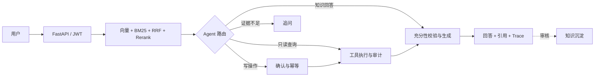

# K8s / DevOps 智能运维 Copilot

> A traceable RAG + Agent copilot for Kubernetes troubleshooting. It combines hybrid retrieval, structured routing, controlled tool execution, write confirmation, audit logs, and knowledge curation in one reproducible local application.

面向 Kubernetes 故障排查的 RAG + Agent 闭环作品项目。用户用自然语言描述 Pod、Service、Ingress、存储或权限问题，系统检索公开的 K8s 知识资料，再判断应该带引用回答、查询演示运行状态、申请执行受控写操作，还是要求补充信息。

项目目录沿用旧名称“企业级智能客服 Copilot”以保留 Git 历史，对外统一使用当前名称。

## 为什么做这个项目

这个项目不是通用聊天机器人，而是用于展示 AI 应用工程中的一条完整链路：

```text
知识入库 → 混合检索 → Agent 路由 → 工具执行/确认
        → 证据充分性校验 → 带引用回答 → Trace/审计 → 知识沉淀
```

它和另一个“智能合同审查助手”形成互补：本项目验证对话式、单轮路由型 Agent；合同项目验证任务式、多步骤编排。

## 核心能力

### 混合检索

- Markdown 结构化切片，保留标题链作为检索上下文。
- Qdrant 向量检索与 BM25 双路召回。
- RRF 按排名融合，避免直接混合不同量纲分数。
- BGE cross-encoder Rerank 和相关性阈值过滤。
- Embedding 模型与维度绑定 collection，切换模型不会污染旧索引。

### Agent 与工具闭环

- 结构化路由：`answer`、`call_tool`、`insufficient`。
- 工具覆盖 Pod、Deployment、告警与工单演示状态。
- 只读工具缓存；写工具二次确认、幂等、白名单和全量审计。
- 信息充分性校验减少“证据不足仍强答”的情况。
- 最大步骤限制和失败收敛，避免无限工具循环。

### 工程化

- FastAPI + Pydantic v2 严格 Schema。
- JWT 身份与 user/admin 角色，跨用户数据隔离。
- SSE 分阶段进度、心跳和统一错误事件。
- SQLite WAL、busy timeout 和短事务边界。
- 请求级 trace：检索、路由、工具、充分性和安全处理均可回溯。
- 人工审核与自动初筛结合的知识沉淀。
- React + TypeScript 前端展示对话、历史、知识库和执行链路。

## 系统架构



详细模块边界见 [架构设计](docs/架构设计.md)。

## 演示场景

| 场景 | 示例 | 预期行为 |
| --- | --- | --- |
| 知识问答 | “Pod 一直 Pending 怎么排查？” | 检索 K8s 文档并给出引用 |
| 只读工具 | “查一下 worker-queue 的副本状态” | 查询演示 Deployment，展示工具 Trace |
| 写操作 | “重启 worker-queue” | 先返回确认卡片，批准后执行一次 |
| 信息不足 | “那个 Pod 怎么样了？” | 要求补充 namespace 和 Pod 名称 |
| 多轮上下文 | 第二轮问“这个 Pod 为什么？” | 关联上一轮实体 |
| 知识沉淀 | 标记一条高质量回答 | 经去重与审核后写回知识库 |

> 数据说明：K8s 知识资料来自公开文档；Pod、Deployment、告警和工单状态是可复现 mock。系统没有连接真实生产集群，也不会执行任意 kubectl/shell 命令。

## 历史评测摘要

场景迁移阶段曾在 7 篇 K8s 文档、约 50 个 chunk 和 38 条案例上记录以下结果：

| 配置 | Hit@5 | MRR |
| --- | ---: | ---: |
| 纯向量 | 57.9% | 0.471 |
| 向量 + BM25 + RRF | 84.2% | 0.693 |
| 完整链路 + Rerank | 86.8% | 0.829 |

同一历史运行还记录知识路由 86.7%、工具路由 100%、faithfulness 0.718、answer relevancy 0.691。

这些是旧配置下的历史基线，不代表当前提交已经通过验收。当前代码的 Embedding 默认值、JWT 和检索逻辑后来发生过变化，正式发布前必须重新运行完整评测。实验条件、失败案例和最新结果入口见 [评测与失败案例](docs/评测与失败案例.md)。

## 技术栈

| 层 | 技术 |
| --- | --- |
| 后端 | FastAPI、Pydantic v2、SQLAlchemy 2.0 |
| LLM | Ollama / 阿里云百炼 Qwen（OpenAI 兼容协议） |
| 检索 | Qdrant embedded、rank-bm25、RRF、BGE Reranker |
| 存储 | SQLite WAL + Qdrant |
| 前端 | React 18、TypeScript、Vite、Playwright |
| 依赖与测试 | uv、pytest、契约测试、E2E、量化评测脚本 |

## 快速开始

### 前置条件

- Python 3.11
- Node.js 与 npm
- Ollama，或可用的阿里云百炼 API Key
- 可选：支持 PyTorch 的 CPU/GPU 环境，用于本地 Rerank

### 1. 后端

```powershell
cd backend
Copy-Item .env.example .env

# 使用项目 Python 3.11 虚拟环境安装依赖；已存在 .venv 时无需重建
uv venv --python 3.11 .venv
# 以已锁定的开发依赖安装；不读取或提交本机 .env
$requirements = Join-Path $env:TEMP 'k8s-copilot-requirements.txt'
uv export --frozen --extra dev --no-emit-project | Set-Content -Encoding utf8 $requirements
uv pip install --python .venv\Scripts\python.exe -r $requirements

.venv\Scripts\python.exe -m uvicorn app.main:app --reload --port 8000
```

本地 Ollama 方案需要提前准备 `.env` 中配置的聊天和 Embedding 模型。启用真实 BGE Rerank 时，再安装 `rerank` 可选依赖及匹配环境的 PyTorch。

### 2. 初始化演示数据

在后端运行后执行：

```powershell
cd backend
$env:COPILOT_SEED_PASSWORD = [guid]::NewGuid().ToString('N')
.venv\Scripts\python.exe scripts\seed_users.py
$env:COPILOT_ADMIN_USERNAME = 'admin'
$env:COPILOT_ADMIN_PASSWORD = $env:COPILOT_SEED_PASSWORD
.venv\Scripts\python.exe scripts\seed_kb.py --docs-dir data\docs_k8s
```

初始化账号密码仅由运行时环境变量提供，脚本不会回显密码；不要把真实密码写进 README。

### 3. 前端

```powershell
cd frontend
npm.cmd ci
npm.cmd run dev
```

访问：

- 前端：<http://localhost:5173>
- API 文档：<http://localhost:8000/docs>
- 健康检查：<http://localhost:8000/api/v1/health>

### Docker 演示

项目根目录已有 `docker-compose.yml`。Docker Desktop、Docker Compose 和宿主机 Ollama
是前置条件；请先将 `.env.example` 复制为 `backend/.env`，并准备其中配置的聊天与
Embedding 模型。容器通过 `host.docker.internal` 访问宿主机 Ollama：

```powershell
docker compose config
docker compose up --build -d

# 服务健康后，在容器内初始化可重复的演示用户与 K8s 知识库
$env:COPILOT_SEED_PASSWORD = [guid]::NewGuid().ToString('N')
docker compose exec -e COPILOT_SEED_PASSWORD backend python scripts/seed_users.py
docker compose exec -e COPILOT_ADMIN_USERNAME=admin -e COPILOT_ADMIN_PASSWORD=$env:COPILOT_SEED_PASSWORD backend python scripts/seed_kb.py --docs-dir data/docs_k8s

# 正常停止与查看状态
docker compose ps
docker compose logs backend
docker compose down
```

初始化账号密码仅由运行时环境变量提供，脚本不会回显密码。Compose
是否满足“干净克隆可复现”仍需按 `项目验收标准.md` 正式验收；存在文件不等于部署已经通过。

### 本地真实验收

启动 Docker Desktop 与 Ollama，并拉取 `qwen2.5:7b`、`bge-m3` 后，可在隔离的
Compose project 中运行下列命令。脚本使用随机运行时密码、独立端口和独立数据卷，默认
开启真实 BGE Reranker；不会自动停止容器或删除证据：

```powershell
# backend/
.venv\Scripts\python.exe scripts\run_local_acceptance.py
```

证据会写入被 Git 忽略的 `backend/acceptance-evidence/<UTC 时间>/`，其中包含脱敏 HTTP
结果、SSE/评测日志、Playwright 报告和成功截图。该命令不调用 Qwen 裁判模型。

## 测试与评测

```powershell
# backend/
.venv\Scripts\python.exe -m pytest tests -q
.venv\Scripts\python.exe scripts\eval_retrieval.py --fake

# frontend/
npm.cmd run typecheck
npm.cmd run build
```

`npm.cmd run e2e`、真实 HTTP 脚本、真实 Ollama 检索与 `eval_ragas.py` 不属于离线 CI；它们可能写入
数据库或调用付费模型，执行前阅读 [AGENTS.md](AGENTS.md) 的验证说明。

截至 2026-08-12，当前候选工作树的 Python 3.11 离线测试（139 项，退出码 0）、前端 lockfile 安装、类型检查与生产构建均已通过；
语料 fake 入库得到 50 个有效 chunk。离线 CI 不替代 Docker/Ollama 验收；后者已在保留的本机隔离现场单独验证，完整状态见
[项目验收标准](项目验收标准.md)。

## 项目限制

- 集群工具使用演示数据，不连接生产 Kubernetes。
- embedded Qdrant 和单机 SQLite 面向本地作品演示，不是高可用生产架构。
- 本地 7B 模型仍可能过度调用工具、过度拒答或编造细节；失败案例公开保留。
- Docker/Ollama 需要额外的本机服务与模型，属于可选真实验收路径，不属于干净克隆的离线 CI；付费 Qwen 裁判和演示录屏仍未验证。
- 当前候选改动尚未提交；必须在指定 commit 的干净克隆中完整复测后，才能判断是否达到 v1.0 门槛。

## 文档导航

| 文档 | 用途 |
| --- | --- |
| [AGENTS.md](AGENTS.md) | Codex 开发命令与架构不变量 |
| [架构设计](docs/架构设计.md) | 当前系统结构和安全边界 |
| [评测与失败案例](docs/评测与失败案例.md) | 指标、实验方法和真实失败记录 |
| [数据来源](docs/数据来源.md) | 来源、许可、哈希与数据治理 |
| [项目验收标准](项目验收标准.md) | v1.0 发布门槛与当前状态 |

## License

代码以 [MIT License](LICENSE) 发布。Kubernetes 知识语料是按 [数据来源](docs/数据来源.md)
逐篇登记的整理文本，继续遵守其 CC BY 4.0 署名要求；它不因代码采用 MIT 而变更许可。
