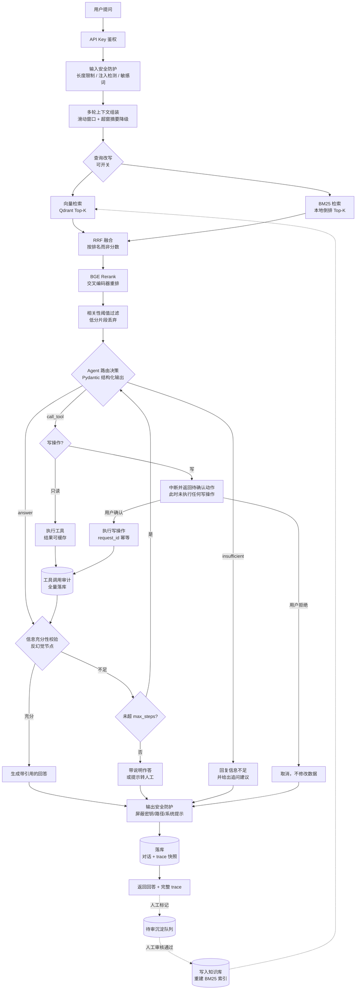

# 企业级智能客服 Copilot

面向企业内部 IT 支持 / SaaS 客服场景的 RAG + Agent 闭环系统。用户用自然语言提问，系统先检索知识库，
再由 Agent 判断该「直接回答」还是「调用工具执行」，执行结果回写对话，优质对话可经人工审核沉淀回知识库。

核心特点是**整条链路可回溯**：每次请求的响应里都带完整执行 trace（检索每一阶段、路由决策与理由、
工具入参出参、充分性校验结论），前端直接渲染，不需要翻后台日志。

## 当前状态

已实现并有测试覆盖：

| 能力 | 验证方式 |
| --- | --- |
| 混合检索（向量+BM25+RRF）+ BGE Rerank | `scripts/eval_retrieval.py` 实测对比，见下文 |
| Agent 路由 / 工具调用 / 反幻觉充分性校验 | `tests/contract/`、`api_examples/` 24 个真实响应样例 |
| 写操作确认 + 幂等 + 全量审计 | `tests/test_user_isolation.py` 等 |
| SSE 流式输出（打字机式进度推送） | `tests/contract/test_chat_stream_contract.py` + `scripts/sse_check.py` 真实联调 |
| 跨用户访问隔离（404 而非 403） | `tests/test_user_isolation.py` |
| SQLite 并发写优化 | `tests/test_db_concurrency.py`、`tests/test_write_lock_duration.py` |
| 沉淀自动质量初筛（去重 + 云端小模型打分，高分自动入库） | `tests/test_sedimentation_screening.py`，见下文 |
| 端到端生成质量评估（自研 RAGAS 风格指标） | `scripts/eval_ragas.py`，见下文 |
| 前端 UI 冒烟（提问 → SSE 流式对话 → 收到回复） | `frontend/e2e/chat_smoke.spec.ts`（Playwright，需真实后端） |

> **数据说明**：账号/订单/工单数据（`app/storage/seed.py`）与知识库文档
> （`data/docs/`）都是为演示而构造的虚构数据，不含任何真实客户或业务信息。
> 这是有意选择——项目定位是验证 RAG+Agent 架构本身（检索质量、路由决策、
> 写操作安全控制），不依赖某个特定客户的真实数据集也能把这些能力跑通、
> 跑出可复现的量化指标。接入真实业务数据时，只需替换 `data/docs/` 下的
> 文档与 `MockAccount`/`MockOrder`/`Ticket` 对应的数据源（当前是 SQLite 表，
> 生产场景通常换成调用企业内部系统的 API），Agent/检索/安全控制层不需要改。

全部 122 个测试通过（`pytest tests/ -q`，2026-08-08 实测）。

`scripts/eval_ragas.py --mode local`（本地 Ollama qwen2.5:7b 生成，裁判固定用云端
`qwen-max`）在最初 30 条知识性标注查询上的真实结果：context_precision 61.7%、
context_recall 83.3%、faithfulness 0.717、answer_relevancy 0.600。这组分数不是用来
展示"效果好"，而是发现了一个真实缺陷——本地模型在部分知识性问题上会把路由决策
错误导向一个无关的写操作确认。用云端 `qwen-plus` 对照后发现**换模型不是银弹**：
误触发工具确实少了，但换成了过度保守地拒绝回答（即使检索证据已经充分），
两种失败模式的答案质量裁判评分一样低。完整的案例分析、根因排查（包括一处
已修正的错误分析）见 [`docs/eval_bad_cases.md`](docs/eval_bad_cases.md)。

`data/eval_set.json` 已扩充到 38 条，新增 8 条带账号视角的工具路由案例
（q31-q38，覆盖只读查询/写操作确认/跨账号查询），用于把 `tool_correctness`
拆分成 `knowledge_routing_accuracy`（该不该调工具时没误调）与
`tool_routing_accuracy`（该调工具时调对了没）两个独立指标——这批新案例
尚未跑过完整评估，只是设计完成。

尚未实现（见文末「技术演进路线」）：多租户/JWT、独立部署的 Qdrant、LLM 网关限流熔断。

## 数据流



## 技术栈

| 层 | 选型 | 说明 |
| --- | --- | --- |
| 后端框架 | FastAPI + Pydantic v2 | 全部 schema `extra="forbid"`，字段漂移直接报错 |
| LLM | Ollama / 阿里云百炼 Qwen | 都走 OpenAI 兼容协议，切换只改 3 个配置项 |
| Embedding | Ollama / Qwen | 集合名绑定「模型 + 维度」，切换不会撞维度 |
| Rerank | BGE-Reranker（本地） | 检索质量基准需固定，不做云端切换 |
| 向量库 | Qdrant embedded | 零外部依赖；上生产改 `url` 即可 |
| 关键词检索 | rank-bm25 | 本地倒排，补足向量检索对专有名词的短板 |
| 元数据 | SQLite + SQLAlchemy 2.0 | 工单 / 对话 / 审计 / 待审队列 |
| 前端 | Vite + React 18 + TypeScript | 类型由后端 OpenAPI 生成，禁止手写 |
| 依赖管理 | uv + pyproject.toml | PEP 621 |

## 设计要点

### RAG 与 Agent 如何协同

检索结果是 Agent 的上下文输入，Agent 通过一个**结构化路由**决定分支，而不是简单关键词匹配：

- `answer` — 知识片段足够，直接带引用回答
- `call_tool` — 需要账号 / 订单 / 工单的实时状态
- `insufficient` — 知识与工具都覆盖不了，给出追问建议

路由输出用 Pydantic 约束，模型给不出合法 JSON 会带校验错误重试一次，仍失败则降级为保守分支。
路由 prompt 里会注入当前提问用户的真实账号 ID，避免模型凭空编造 ID（这是实测中真实踩到的坑）。

### 检索质量优化

分块策略做成可替换接口，两种实现：

- `CharOverlapChunker` — 定长滑窗 + 重叠，切点吸附到自然断句
- `MarkdownHeaderChunker` — 按标题层级切分并保留标题链，代码块内的 `#` 不误判为标题

召回用双路并行 + RRF 融合。用**排名**而非原始分数融合，因为余弦相似度和 BM25 分数量纲不可比。
再过 BGE 交叉编码器重排，最后按阈值丢弃低分片段——没有这个阈值，无关查询也会返回 Top-K，
「检索为空」分支永远走不到，模型就会拿着无关片段硬编答案。

#### 文本表示必须三处一致

Markdown 分块把「现象 / 根因 / 处理步骤」切成独立 chunk 后，单独一段会丢掉上下文：
「根因」段落写的是「账号的 permission_level 为 restricted」，**不含 403 也不含"登录"**。

所以每个 chunk 都带标题链（`403 Forbidden 权限不足 > 根因`）参与检索。关键在于
**向量嵌入、BM25 索引、Rerank 三处必须用同一种文本表示**（`contextual_text`）。

实测踩到的坑：嵌入用了带标题链的文本，Rerank 却只看裸正文。结果查「登录提示 403 是什么原因」时，
Rerank 给现象描述段打 0.90，给含答案的根因段打 **0.056**，直接把正确片段从第 2 位挤到第 12 位——
Rerank 反而让 Hit@5 从 100% 降到 91.7%。统一表示后该片段得分回到 0.827，稳定在第 2 位。

这个隐式契约由 `tests/test_text_representation.py` 锁定，防止重构时退回裸文本。

#### 实测数据

`scripts/eval_retrieval.py` 在 30 条标注查询上跑三组对比。召回 20 条候选后取 Top-5，
命中判定为「输出片段中出现期望关键词」。模型：`nomic-embed-text` + `bge-reranker-base`（本地 GPU）。

| 配置 | Hit@1 | Hit@3 | Hit@5 | MRR | 均排名 | 延迟 |
| --- | --- | --- | --- | --- | --- | --- |
| A. 纯向量检索 | 53.3% | 70.0% | 70.0% | 0.611 | 1.29 | 219ms |
| B. 混合检索（向量+BM25） | 70.0% | 73.3% | 86.7% | 0.750 | 1.50 | 51ms |
| C. 混合检索 + Rerank | **90.0%** | **93.3%** | **96.7%** | **0.925** | **1.14** | 422ms |

其中 17 条是口语化 / 易混淆查询（不含任何文档术语，如「同事都能进就我进不去」），
单看这个子集差距更明显：

| 配置 | Hit@3 | MRR |
| --- | --- | --- |
| A. 纯向量检索 | 52.9% | 0.431 |
| B. 混合检索 | 58.8% | 0.632 |
| C. 混合检索 + Rerank | **88.2%** | **0.897** |

Rerank 单独贡献 Hit@1 +20pp、hard 子集 Hit@3 +29.4pp，未命中从 4 条降到 1 条。

两个评估设计上的坑，都是实测撞出来的：

1. **召回宽度必须显著大于输出宽度**。最初召回 5 条、输出 5 条，Rerank 只是调整这 5 条的顺序，
   不改变集合成员，Hit@5 必然不动 —— 看起来像「Rerank 无效」，实则是评估设计问题。
   现在召回 20 取 5，Rerank 才有筛选空间。
2. **评估集要有区分度**。12 条查询时混合检索已达 Hit@5=100%、均排名 1.58，基线接近天花板，
   任何重排都无从改进。扩到 30 条并加入口语化查询后，差距才显现。

补充了 `均排名`（命中片段的平均位次）这个指标：Hit@K 只看是否落在集合内，
对「往前提了几位」不敏感，而这恰是 Rerank 的主要作用。

单条案例可复现（`scripts/diagnose_case.py q29`）：查询「为什么手机流量可以电脑不行」，
混合检索把正确片段（内网防火墙拦截）排在第 8 位（跌出 Top-5），Rerank 后拉回第 1 位。

Rerank 不是单向提升——同一脚本跑 `q22`（「登录证书过期了怎么更新」）会看到反例：
混合检索本已排第 1，Rerank 反而把它压到第 8 位，被「订单逾期未付款」这类不相关片段挤到前面。
这类真实的负向案例记录在 [`docs/eval_bad_cases.md`](docs/eval_bad_cases.md)。

### 工具调用的安全控制

| 约束 | 落地方式 |
| --- | --- |
| 读写分离 | `Tool.is_write` 标记；启动时自检写工具契约 |
| 写操作确认 | 路由选中写工具即中断返回待确认动作，**确认前审计表为空** |
| 幂等 | 写工具强制 `request_id`，审计表唯一约束；重复请求返回原结果不重复执行 |
| 缓存边界 | 仅只读工具可缓存，写工具代码层面禁止接入 |
| 运行内去重 | 同一轮内失败的调用不重试、成功的写操作不重复执行（防确认循环） |
| 全量审计 | 读写调用都落库并立即提交：入参出参、耗时、成败、是否命中缓存、是否幂等重放 |
| 入参校验 | Pydantic `extra="forbid"`，模型幻觉出的多余字段直接失败 |

### 反幻觉

路由与回答之间插了一个**信息充分性校验**节点：LLM 先结构化判断现有证据能否支撑准确回答，
不足则补充检索或换工具，达到 `max_steps` 后兜底。若此时已有证据，会带「未通过完整校验」的说明作答，
而不是丢弃已取得的数据。

### 异常分级与重试

| 类别 | 例子 | 策略 |
| --- | --- | --- |
| 可重试 | LLM 超时、限流、连接中断、向量库临时不可用 | tenacity 指数退避，最多 3 次 |
| 不可重试 | 参数校验失败、凭证错误、工具权限不足、业务规则冲突 | 立即抛出 |

一个实测踩到的坑：Ollama 会把后端进程的**传输层**故障包装成 HTTP 400 返回。
若按「400 一律不重试」处理，一次网络抖动就会让整个入库失败。因此对 400 会检查传输层特征
（`connection reset` / `wsarecv` / `EOF` / `broken pipe` 等）再判定，相关边界有 19 个单元测试锁定。

### 长耗时链路的流式推送

一轮对话要串联 4 次 LLM 调用（查询改写 → 路由 → 充分性校验 → 生成回答）。
本地 7B 模型下单次往返最快 1.6s，但输出较长时累计到 20–40s。非流式接口下前端只能干等，
用户会误判为卡死并重复提交，产生多个重复会话。

所以提供 `POST /api/v1/chat/stream`（SSE），逐阶段推送进展：

```text
event: progress   {"phase":"guarded","label":"输入安全检查通过","elapsed_ms":3}
event: progress   {"phase":"retrieved","label":"检索到 5 条相关片段","elapsed_ms":1820}
event: progress   {"phase":"agent_step","label":"正在判断该直接回答还是调用工具",...}
event: done       {...与非流式 /chat 完全一致的 ChatResponse...}
```

`scripts/sse_check.py` 对本地 Ollama（qwen2.5:7b，无 GPU 加速的检索冷启动场景）的一次真实联调结果：
首个进度事件 0.62s 到达，总耗时 46.3s，最长单阶段等待 20.3s（发生在检索阶段）。
非流式接口下用户会在这 46s 里干等，流式接口能在 1s 内看到「已收到」的反馈。

三个实现要点：

- **同步代码放线程池**。Agent 全链路是同步的（SQLAlchemy + openai 同步客户端），
  在线程里跑并用 `call_soon_threadsafe` 把事件送回事件循环。线程内独立开 session，
  不能复用请求线程注入的那个（Session 非线程安全）。
- **先发事件再判断断连**。反过来写会在连接尚未完全建立时误判为已断开，丢掉第一个事件。
- **客户端断开不回滚**。后台线程继续跑完并落库，用户重开历史记录仍能看到这轮结果。
- **代理层必须关缓冲**。nginx 需要 `proxy_buffering off`、Vite dev 代理需放宽 `proxyTimeout`，
  否则事件会被攒到最后一起吐出，流式退化成普通请求。
- **长间隔要发心跳**。单个 LLM 调用可能十几秒不产生新阶段，期间连接空闲会被代理按读超时回收
  （nginx 默认 60s）。每 10s 发一个 SSE 注释帧 `: keep-alive` —— 注释帧按规范会被解析器忽略，
  不会被误认成空事件。
- **error 事件要带 http_status**。SSE 帧发出时 HTTP 状态码已经是 200，客户端无从得知
  这个错误「本该」是几百。不带的话前端只能一律当 500 —— 注入拦截（422）会被误报成
  服务器故障，`retryable` 判断也跟着失真。
- **前端用空闲超时，不用总时长上限**。总时长上限会误杀「慢但正常」的长链路；
  空闲超时（45s 收不到任何数据）配合服务端心跳，只在真挂死时触发。

错误也走 SSE（`event: error`，载荷即统一错误格式），前端可复用同一套错误展示。
`ChatStreamEnvelope` 这个 schema 只为让三类载荷进入 OpenAPI，从而被前端类型生成脚本收录。

### SQLite 并发写

WAL 让「读不阻塞写」，但**写与写仍互斥**。默认配置下并发写的第二个连接会立刻抛
`database is locked` 而不是排队 —— 实测中前端连点两次发送就能命中。

修法分两层，第二层才是根治：

1. **配置层**：`busy_timeout=10000`（拿不到写锁时轮询等待而非立即失败）、
   `synchronous=NORMAL`（WAL 下不牺牲一致性但快一个数量级）、
   `wal_autocheckpoint=1000`（不设会让 WAL 文件无限增长）、连接池复用。
2. **事务边界**：原实现在 `flush()` 开启写事务后才跑检索 + Agent 循环，
   **全程 20–40s 都攥着写锁** —— 这种情况下 `busy_timeout` 给多久都不够。
   现在把「建会话 + 落用户消息」收成一个独立短事务（`_open_turn`）立即提交，
   长耗时段完全不持锁。

   第一版修得不彻底：`commit()` 加在了 `_resolve_conversation` **之后**，
   而新建会话时它内部的 `flush()` 已经开启了写事务。真实浏览器场景下
   SSE 对话与 health 轮询并发，崩溃点就在 `INSERT INTO conversations` ——
   等满 10s 然后抛 `database is locked`。单发请求测不出来，必须并发才能复现。

3. **中段写入也要提交**：工具审计在 Agent 循环中段写入，后面还有多次 LLM 调用。
   原来只 `flush()`，等于又把写锁攥到整轮结束 —— 三个对话并发时第二个请求的
   `INSERT INTO tool_call_audits` 就撞锁。改为 `commit()`：审计记录语义上独立
   （它记的是"已经发生的事"，不该因后续步骤失败而回滚），提前提交反而更正确。

验证分三层：`tests/test_db_concurrency.py`（8 线程并发写验证配置层）、
`tests/test_write_lock_duration.py`（在检索入口探测写锁是否已释放，并制造
持锁线程验证新建会话仍能排队成功）、`scripts/concurrent_check.py`
（对真实服务发起多路 SSE + 轮询，复现浏览器场景）。

### 生产环境配置护栏

一批只在 `ENVIRONMENT=prod` 下生效的硬性校验，不满足就拒绝启动：

| 检查 | 理由 |
| --- | --- |
| `API_KEY` 不能是开发默认值 | 默认值公开在 `.env.example` 里，等于没有鉴权 |
| `API_KEY` 至少 24 字符 | 短密钥可暴力枚举 |
| `CORS_ALLOW_ORIGINS` 不含 `*` 或 localhost | 通配来源让任意站点可带凭证调用 |

宁可起不来，也不要带着弱密钥上线 —— 这类问题漏到线上，外部就能直接调用全部接口。

`/health` 无需鉴权，所以生产下只返回 `status` 与 `environment`；
模型 provider、集合名这些内部拓扑属于侦察信息，改由需要鉴权的 `/readiness` 提供。

### 跨用户访问隔离

API Key 只证明「是我们的客户端」，不代表「可以读任何人的数据」。
所有以 `conversation_id` 为入口的操作都要过 `_load_owned_conversation` 校验归属：

| 端点 | 缺少校验的后果 |
| --- | --- |
| `POST /chat`（带 conversation_id） | 往别人的会话里追加消息 |
| `POST /chat/confirm` | **拿到 id + token 就能执行别人的写操作**（重置缓存、创建工单） |
| `GET /conversations/{id}` | 遍历 id 读取任意用户的对话与完整执行链路 |
| `GET /conversations` | 不传 user_id 时返回所有人的会话 |
| `GET /tool-audits` | 工具入参出参含账号状态、订单信息 |

两个实现细节：

- 历史类端点的 `user_id` 改为**必填**，不传返回 422 而不是「返回全部」。
  可选参数的默认行为是「不过滤」，这类默认最危险。
- 越权访问返回 **404 而非 403**。403 等于确认「这个 id 存在但不属于你」，
  反而方便枚举有效 id。

`tests/test_user_isolation.py` 用 owner / intruder 两个身份覆盖全部路径，
其中写操作越权还额外断言审计表没有留下写记录。

### 前后端契约

后端 schema 是唯一事实来源：

1. 全部 Request/Response 继承 `StrictBaseModel`（`extra="forbid"`，时间统一 UTC ISO）
2. `scripts/generate_frontend_types.py` 从 OpenAPI 生成 `frontend/src/api/types.ts`，**禁止手写前端类型**
3. `tests/contract/` 打掉 LLM / Qdrant / Rerank，只校验响应 JSON 与 schema 一致，不依赖真实模型
4. `scripts/export_api_examples.py` 导出全部业务分支的真实响应样例到 `backend/api_examples/`
5. 所有错误统一为 `{code, message, trace_id, retryable, details}`，堆栈只进日志

改任何后端 schema 后必须重跑类型生成脚本。

## 快速开始

前置：**Python 3.11**、Node 18+、Ollama（或百炼 API Key）。

> 为什么锁 3.11：`FlagEmbedding`（Rerank）依赖 torch，3.11 的预编译 wheel 最成熟。
> 代码本身兼容 3.11–3.13。
>
> 另外**不要用 `pip install -e`**：可编辑安装会写入含中文的项目路径到 `.pth` 文件，
> Python 3.11 在中文 Windows（GBK 默认编码）下启动解释器时会 `UnicodeDecodeError`。
> 依赖直接装，`app` 与 `tests` 的导入由 `pyproject.toml` 里的 `pythonpath = ["."]` 解决。

```bash
# 后端
cd backend
py -3.11 -m pip install uv
py -3.11 -m uv venv --python 3.11
py -3.11 -m uv pip install --python .venv/Scripts/python.exe -r pyproject.toml
cp .env.example .env          # 按需修改 provider 与模型

# 拉模型（本地方案）
ollama pull qwen2.5:7b
ollama pull nomic-embed-text  # 或 bge-m3（需同步改 OLLAMA_EMBEDDING_DIM）

.venv/Scripts/python -m uvicorn app.main:app --reload --port 8000
```

### 可选：启用 Rerank

Rerank 依赖 torch（约 2.5 GB），单独成组。**不装也能跑** —— 检索链路会自动降级为
RRF 融合顺序，`trace.retrieval.rerank_applied` 会标记为 `false`，功能不中断。
但要产出「Rerank 前后对比」的量化指标，必须装上。

```bash
# GPU（推荐，需 NVIDIA 显卡）：先装对应 CUDA 版本的 torch
py -3.11 -m uv pip install --python .venv/Scripts/python.exe \
    torch --index-url https://download.pytorch.org/whl/cu124
# CPU：跳过上一步，直接装下面这个（会自动拉 CPU 版 torch）
py -3.11 -m uv pip install --python .venv/Scripts/python.exe "FlagEmbedding==1.3.3"

# 验证模型能加载且重排生效（首次会下载模型约 1.1 GB）
.venv/Scripts/python scripts/check_reranker.py
```

国内下载 HuggingFace 模型慢的话先设镜像：`$env:HF_ENDPOINT="https://hf-mirror.com"`。
显存吃紧时在 `.env` 里设 `RERANK_DEVICE=cpu`（fp16 会自动关闭）。

模型加载有两处优化，都是实测撞出来的：

- **本地已缓存就切离线**。`FlagEmbedding` 加载时会向 HuggingFace 发 HEAD 请求校验版本，
  国内网络下每个文件连接超时 10s 再重试 5 次 —— 实测让模型加载耗时 **294 秒**，
  而模型本来就在本地、最终也加载成功了。

  修这个坑有个容易踩空的细节：**只设 `os.environ["HF_HUB_OFFLINE"]` 不生效**。
  `huggingface_hub` 在 import 时就把它固化成模块常量了，运行时改环境变量已经太晚
  （我第一版就是这样，环境变量确认设对了但仍白等 294s）。所以要么在 import 之前设，
  要么同时改已加载模块的常量 —— 现在两者都做。加载耗时降到 **7.9 秒**。

  只在缓存已存在时启用离线，缓存缺失时保持在线，避免挡住首次下载。

- **启动后后台预热**。冷启动开销不该落在第一个用户请求上。用 `asyncio.to_thread`
  加载（同步阻塞代码不能卡事件循环），服务立即可用，模型就绪前检索自动降级为
  RRF 融合顺序。`WARMUP_RERANKER=false` 可关掉。

### 前端

```bash
cd frontend
npm install
npm run dev                    # http://localhost:5173
```

首次打开前端点「设置」填入与 `.env` 一致的 API Key，然后到「知识库」页上传文档
（`backend/data/docs/` 下有两篇示例文档可直接粘贴）。

### 切换到云端 Qwen

```ini
LLM_PROVIDER=qwen
EMBEDDING_PROVIDER=qwen
QWEN_API_KEY=sk-xxx
```

Embedding 换 provider 会因维度不同启用另一个 Qdrant 集合，需重新灌库。
6G 显存机器建议 Embedding 走云端、本地只留 Rerank。

### 换一个行业验证架构通用性

检索/评估脚本不绑定客服领域——`data/docs_education/`（学生选课系统 FAQ，2 篇文档
12 个 chunk）+ `data/eval_set_education.json`（8 条标注查询）是一个最小示例，
证明只换知识库文档和评估集、不改一行代码就能跑通同一套检索链路：

```bash
.venv/Scripts/python scripts/eval_retrieval.py \
  --docs-dir data/docs_education --eval-set data/eval_set_education.json
```

真实跑出来的结果（同样是纯向量 / 混合检索 / 混合+Rerank 三组对比）：

| 配置 | Hit@1 | Hit@3 | Hit@5 | MRR |
| --- | --- | --- | --- | --- |
| A. 纯向量检索 | 37.5% | 62.5% | 75.0% | 0.504 |
| B. 混合检索 | 50.0% | 75.0% | 100.0% | 0.681 |
| C. 混合检索 + Rerank | **75.0%** | **100.0%** | **100.0%** | **0.875** |

趋势与客服领域一致——Rerank 在口语化 hard 子集上的提升同样最明显（Hit@3 +40pp），
说明这是检索链路本身的能力，不是针对客服场景调出来的。8 条案例规模刻意做小，
只用于验证通用性，不是一份完整评估集。

## 常用命令

```bash
# 后端（backend/ 目录下）
.venv/Scripts/python -m pytest tests/ -q           # 全部测试
.venv/Scripts/python scripts/eval_retrieval.py     # 检索质量三组对比
.venv/Scripts/python scripts/check_reranker.py     # 验证 Rerank 是否真在重排
.venv/Scripts/python scripts/diagnose_case.py q01  # 单条查询 Rerank 前后排名对比
.venv/Scripts/python scripts/export_api_examples.py    # 导出接口样例
.venv/Scripts/python scripts/generate_frontend_types.py # 生成前端类型
.venv/Scripts/python scripts/seed_kb.py            # 把 data/docs 灌进运行中的服务
.venv/Scripts/python scripts/e2e_check.py          # 端到端联调（需服务已启动）
.venv/Scripts/python scripts/sse_check.py          # SSE 事件时序与到达延迟
.venv/Scripts/python scripts/concurrent_check.py   # 多路 SSE + 轮询，复现浏览器并发场景
.venv/Scripts/python scripts/probe_lock.py         # 诊断 SQLite 写锁排队行为

# 前端（frontend/ 目录下）
npm run typecheck
npm run build
npx playwright install chromium   # 首次运行 e2e 前需要（下载浏览器二进制）
npm run e2e                        # UI 冒烟测试，需要后端已启动且知识库已灌入文档
```

## Docker 一键启动

```bash
cp backend/.env.example backend/.env
docker compose up --build       # 前端 :5173，后端 :8000
```

## 目录结构

```text
backend/
  app/
    config.py  errors.py  auth.py  middleware.py  startup_checks.py
    exception_handlers.py  dependencies.py
    llm/          统一 OpenAI 兼容客户端 + 异常映射
    rag/          分块策略 / Qdrant / BM25 / RRF / Rerank / 查询改写 / 检索编排
    agent/        路由 / 充分性校验 / 状态机 / 工具体系（读写分离·幂等·审计·缓存）
    knowledge/    文档入库 / 半自动沉淀
    storage/      SQLAlchemy 模型 / 会话 / mock 数据
    security/     输入输出防护
    services/     chat / knowledge / history 服务层
    schemas/      全部对外契约（StrictBaseModel）
    tracing/      trace 上下文 / 结构化日志 / trace 构建
    api/          路由
  api_examples/   各业务分支响应样例（24 个）
  data/           示例文档 / 评估标注集 / SQLite / Qdrant 存储
  scripts/        评估 / 样例导出 / 类型生成 / 端到端检查
  tests/          契约测试 + 异常分级 + 对账测试
frontend/
  src/api/        client.ts（手写）+ types.ts（生成物）
  src/components/ TraceViewer 等
  src/pages/      对话 / 知识库 / 历史记录
```

## 技术演进路线（二期）

当前是 MVP，以下为规划中的方向：

- **向量库升级** — embedded 模式切为独立服务端 Qdrant，支持分布式与水平扩容
- **多租户与鉴权** — 引入用户 / 角色 / 权限模型，落地 JWT，支持多知识库隔离
- **知识库版本管理** — 文档更新支持版本回溯，向量集合灰度切换
- **LLM 网关层** — 统一限流、熔断、降级、多模型负载均衡与故障切流
- **沉淀多级审校** — 当前自动初筛只有一级（去重+质量分），生产级方案还需人工复审自动通过的条目
- **min_rerank_score 分层阈值** — 全局固定阈值已从 0.15 调到 0.12（详见
  `eval_bad_cases.md`「阈值敏感性分析」一节），但仍是全局一刀切；`eval_bad_cases.md`
  记录的 q14 类查询要救回需要把阈值降到 0.05，代价（噪声候选翻倍）对全局不划算，
  需要按查询难度或改写后置信度分层设置才能兼顾
- **工具路由误判修复** — `eval_bad_cases.md`「真实缺陷」一节已定位到根因（`login_troubleshooting.md`
  的"处理步骤" chunk 脱离上下文后被路由模型误判为操作指令），三个候选修复方向
  （chunk 元数据标记 / 关联召回 / 路由 prompt 约束）已列出但未实施——样本量小
  （2 个 chunk），改动面涉及分块/检索/路由多层，需要更多同类案例验证是普遍模式
  而非过拟合单条 bad case 才动手
- **过度保守拒绝的检测** — 云端 `qwen-plus` 对照实验发现，模型有时会在检索证据充分的情况下
  仍拒绝回答（而不是乱调工具），这类"证据够但装看不见"的失败目前和"真的答不出来"混在
  同一个 `insufficient_information` 分支里，评估指标也没有区分，需要专门识别
