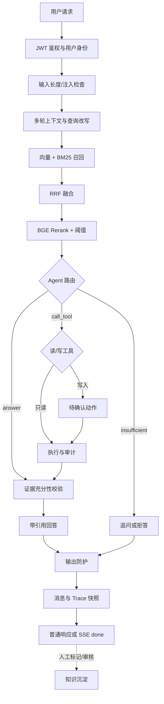

# K8s / DevOps 智能运维 Copilot 架构设计

本文档只描述当前系统的模块关系和工程边界。开发命令见根目录 `AGENTS.md`，指标与实验见 `docs/评测与失败案例.md`，发布状态见 `项目验收标准.md`。

## 1. 系统目标与边界

系统面向 Kubernetes 故障排查：用户用自然语言描述现象，系统检索官方知识文档，并决定直接回答、查询演示集群状态、申请执行受控写操作，或要求补充信息。

知识文档来自真实公开资料；Pod、Deployment、告警和工单是确定性的演示数据。系统不连接生产集群，不允许任意 shell/kubectl 执行，也不承担多集群管理或可观测性平台职责。

## 2. 总体数据流

`app/services/chat_service.py` 是业务编排入口；`app/agent/state_machine.py` 负责有限步状态流转。API 路由不复制业务规则。

## 3. RAG 链路

### 3.1 文档与切片

知识入库支持字符滑窗和 Markdown 标题分块。K8s 文档默认按标题结构切分，chunk 保留标题链和正文，形成统一的 `contextual_text`。

向量、BM25 和 Rerank 必须使用同一文本表示。标题只参与某一阶段会造成召回与重排目标不一致，这是已发生过的回归类型。

### 3.2 召回、融合与重排

1. 可选查询改写补充多轮上下文中的省略实体。
2. Qdrant 向量检索与本地 BM25 并行召回候选。
3. RRF 按排名融合，不直接混合余弦相似度和 BM25 原始分数。
4. BGE cross-encoder 对较宽候选集重新排序。
5. 低于阈值的片段被过滤，使无证据分支真实可达。

Embedding 模型和维度进入 Qdrant collection 名；切换模型需要使用新集合并重新入库。当前 provider 和模型以 `.env`/`app/config.py` 为准，不在架构文档固定成本机配置。

### 3.3 Chunk 类型与关联召回

Markdown chunk 可携带 `is_procedural`/`chunk_type` 元数据，帮助路由器区分“文档里有处理步骤”和“用户要求系统执行操作”。命中步骤段时，Retriever 可关联召回同文档上下文，避免只有操作步骤而缺少现象与根因。

元数据只是辅助信号，不能替代量化评测；任何 Prompt 或关联召回调整都要同时观察知识路由与工具路由，防止修复一类问题时伤害另一类。

## 4. Agent 与工具系统

### 4.1 路由与充分性

路由器通过结构化 LLM 输出选择：

- `answer`：现有知识证据足够，进入充分性校验和回答生成。
- `call_tool`：需要查询或修改演示运行状态。
- `insufficient`：缺少资源身份、证据或能力，返回追问建议。

工具执行后再次进行充分性校验；信息不足且未超过最大步骤时回到路由。达到上限后返回带限制说明的结果，不能无限循环。

回答器只使用检索片段和工具结果中的事实，工具返回值要求逐字保真；不得编造资源状态、已执行命令或未出现的 kubectl 参数。

### 4.2 工具注册与执行

`app/agent/tools/` 将工具契约、注册、执行、缓存与具体业务实现分开：

- 只读工具允许短时缓存，并记录是否命中缓存。
- 写工具禁止缓存，必须含 `request_id`，执行前返回确认 token。
- 确认前不产生业务写入和成功审计；拒绝后 token 不能再次批准。
- `(conversation_id, request_id)` 保证跨请求幂等，避免不同会话因模型生成相同 ID 而串结果。
- 入参由 Pydantic 校验，多余字段直接失败。
- 所有读写调用记录工具、输入、输出、耗时、成功状态、缓存和幂等信息。

工具操作的是演示表，不执行真实集群命令。未来若接 kind/minikube，应保持同一安全契约并使用最小权限适配器。

## 5. 身份、权限与安全

### 5.1 JWT 与角色

`/api/v1/auth/login` 和注册接口提供身份入口；业务端点从 JWT `sub` 获取用户，不能信任请求体里的 `user_id`。

- 普通用户访问自己的会话、消息、工具审计和沉淀标记。
- admin 管理共享知识文档与沉淀审核。
- 跨用户资源统一表现为不可见，避免通过状态码枚举资源。
- `/health` 公开；`/readiness` 需要身份，并展示依赖检查。

生产启动检查拒绝默认密钥、弱 JWT secret、通配 CORS 和 localhost 来源。

### 5.2 输入与输出防护

输入层限制长度并拦截明显提示词注入；输出层屏蔽密钥、内部路径和系统提示。错误统一为 `{code, message, trace_id, retryable, details}`，堆栈只写服务日志。

这些防护降低风险但不等于完整安全沙箱，因此工具白名单和写操作确认仍是主要安全边界。

## 6. API、SSE 与前端状态

后端 Schema 是接口唯一事实来源，全部请求/响应使用严格 Pydantic 模型。前端类型和 API 样例由脚本生成，避免三份手写结构漂移。

长链路通过 SSE 发送阶段性 `progress`、最终 `done` 或 `error`：

- 心跳使用 `: keep-alive` 注释帧，代理和前端不得当成业务事件。
- error 载荷包含原始 `http_status`，因为 SSE 连接已经返回 HTTP 200。
- 同步 Agent 在线程池运行；线程使用独立数据库 Session。
- 客户端断开不回滚已开始的后端任务，最终结果仍可在历史记录中读取。

前端 `useChat` 集中管理请求状态：回合序号丢弃过期响应，ref 防止连点重复提交，待确认卡片只在写操作成功或明确取消后清除。

## 7. 存储、并发与 Trace

SQLite 保存用户、组织、会话、消息、工具审计和沉淀队列；Qdrant 保存向量，BM25 保存在进程内并在知识变更后重建。

SQLite 使用 WAL、busy timeout 和自动 checkpoint。事务中只做必要数据库读写；LLM、Embedding、Rerank 与其他外部调用必须在写事务外执行，避免长时间占用写锁。

每次完成请求保存最终响应和完整 Trace 快照。历史页面读取快照，不根据当前 Prompt 或配置重建旧 Trace。

## 8. 知识沉淀

用户可以把自己的优质对话送入待审队列。系统先用向量相似度检查重复，再用独立质量模型评价完整度、可回答性和敏感信息：

- 重复内容留给人工判断合并或拒绝。
- 高分、无敏感信息内容可自动批准，并标记系统审核者。
- 低分或含敏感信息内容进入人工审核。
- Embedding、向量库或质量模型不可用时降级为人工审核，不阻止标记动作。

通过审核后写入共享知识库并重建关键词索引。

## 9. 已知边界

- 运行状态与写操作是演示数据，不是生产集群事实。
- embedded Qdrant 和单机 SQLite 适合本地作品演示，不是高可用部署。
- 本地小模型在路由和生成上存在过度调用工具、过度拒答和编造细节风险，具体见评测文档。
- 知识初筛、云端生成和裁判依赖外部模型时会产生费用；应在运行前明确模式和样本范围。
